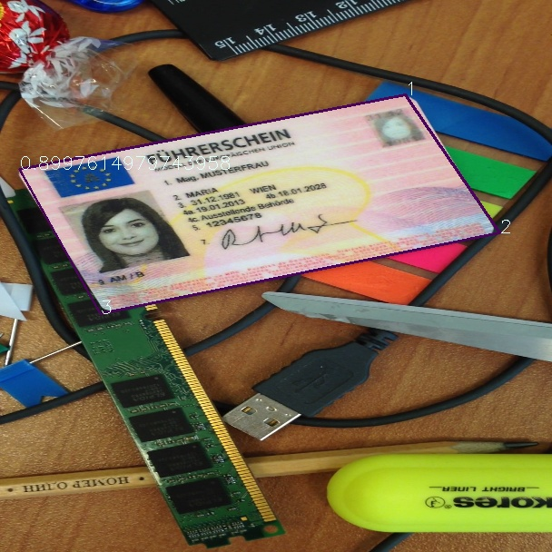
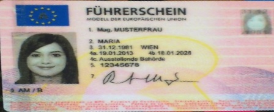
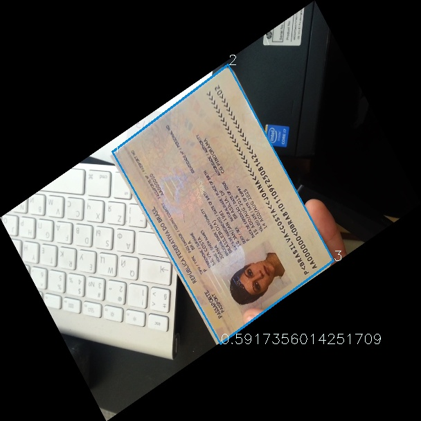
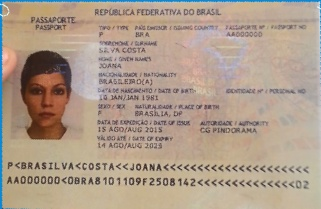

# YOLOv3 with quadrangle for card detection and orientation correction
Reimplementation of YOLOv3 with quadrangle

This is a reimplementation of [YOLOv3: An Incremental Improvement](https://pjreddie.com/darknet/yolo/) and is based on [Ultralytics LLC's PyTorch implementation](https://github.com/ultralytics/yolov3).
This work detects obejcts in arbitrary directions with quadrangle, and implemented on [Midv-500](https://arxiv.org/abs/1807.05786)  dataset for example.

## Requirements
* Python3
* numpy
* torch
* opencv-python
* Shapely

## Train
Check the -data_config_path and -cfg in train.py. 

Dataset folder is organized as follows:

* Dataset
    * images
    * labels

The label format: class x1 y1 x2 y2 x3 y3 x4 y4 

For example (0 493 115 519 115 519 131 493 131)

`$ python3 train.py`

## Train for your own dataset

- Modify `yolov3.cfg` file
  - Change `[yolo]` classes with the number of classes in your own dataset.
  - Replace the value of filters in `[convolutional]` which lays above `[yolo]`, filters should be `3 * (8 + 1 + num_classes)`, where `8` means 8 offsets of the quadrangle, `1` means objectness confidence.
- Modify `cfg/*.data` where classes field should be your number of classes in your dataset
- Modify `data/*names` and put your labels in it. 

## Inference
Checkpoints are saved in weights.

`$ python3 detect.py`

## Results

1. Predicted bounding box plotted on the image
 
- After applying rotation correction  

2. Predicted bounding box plotted on randomly rotated image
 
- After applying rotation correction 

## This rotation correction can be used to correct orientation of the card which can be used for applying image to text and extract text correctly from the card.

